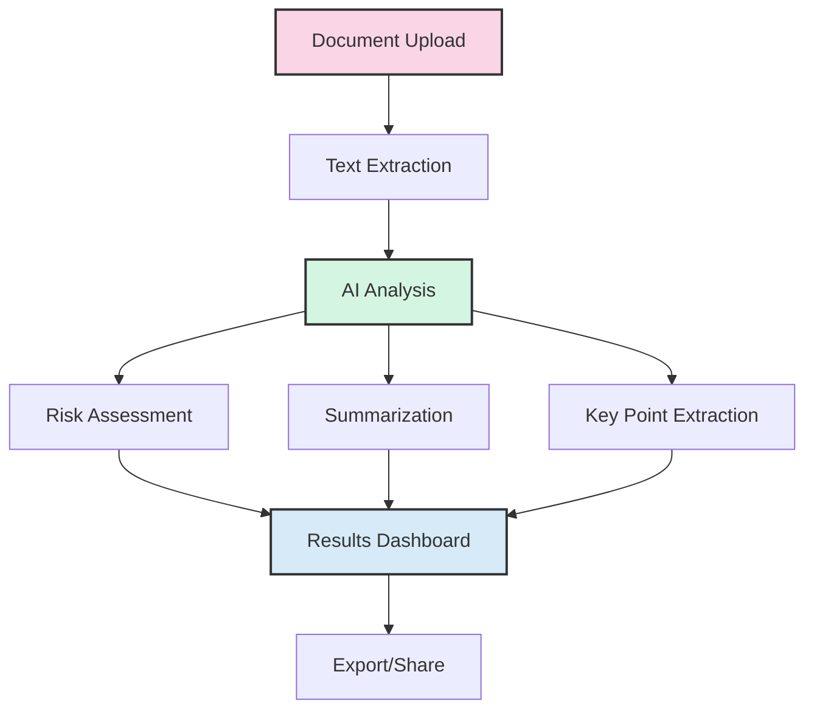
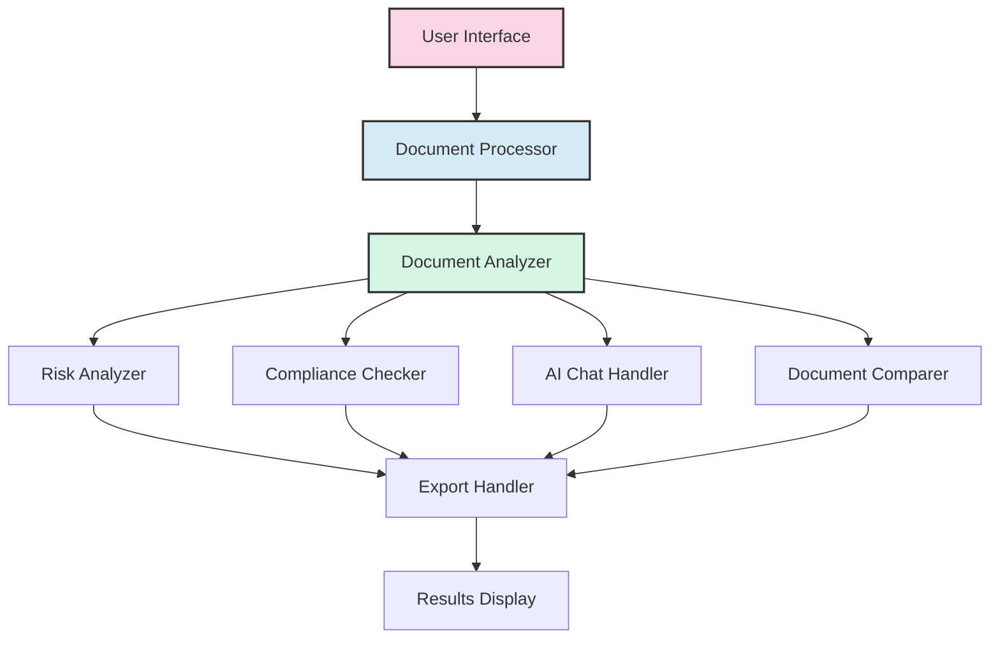
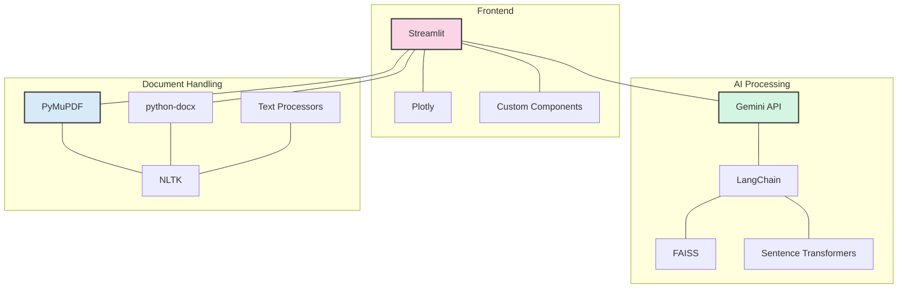
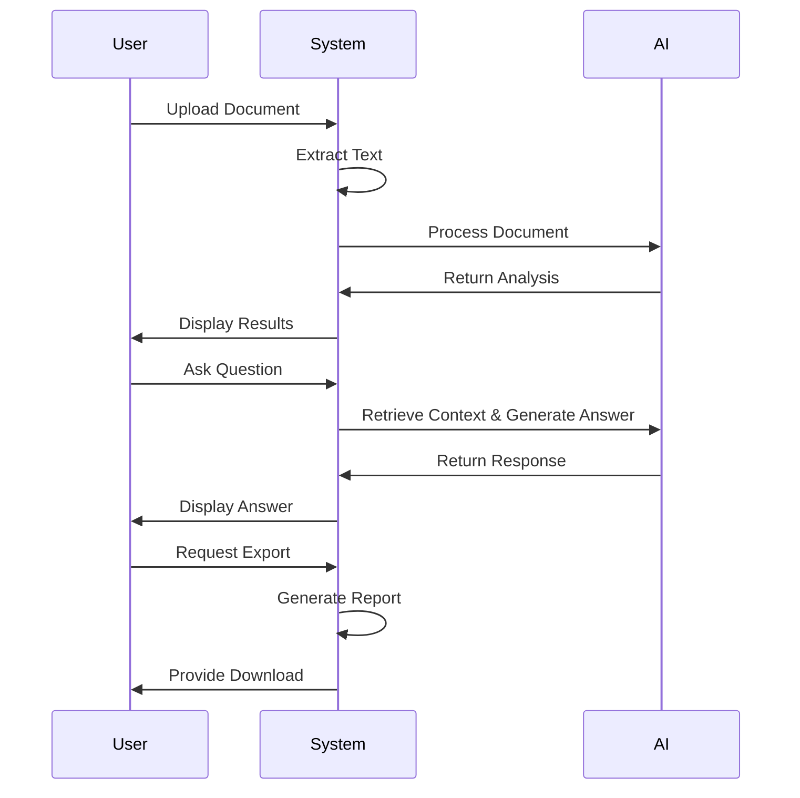

# AI-Driven Legal Document Analysis System

<div align="center">


A powerful, AI-driven tool designed to analyze, summarize, and assess risks in legal documents. Leveraging state-of-the-art language models and specialized legal analysis techniques to help legal professionals save time and gain deeper insights.

</div>

## Table of Contents

1. [Key Features](#key-features)
2. [System Architecture](#system-architecture)
3. [Technology Stack](#technology-stack)
4. [Installation Guide](#installation-guide)
5. [Usage Guide](#usage-guide)
6. [Implementation Highlights](#implementation-highlights)
7. [Module Overview](#module-overview)
8. [Performance Optimization](#performance-optimization)
9. [Troubleshooting](#troubleshooting)
10. [Future Roadmap](#future-roadmap)
11. [License & Attribution](#license--attribution)

---

## Key Features

### Document Analysis & Processing
- 📄 **Document Summarization**: Generate concise, accurate summaries of complex legal documents
- 🎯 **Key Point Extraction**: Identify and highlight critical information and clauses
- 🔄 **Multi-Format Support**: Process PDF, DOCX, and TXT files with specialized handling

### Risk & Compliance
- ⚠️ **Risk Assessment**: Identify potential legal risks with severity ratings and visualizations
- 📊 **Risk Visualization**: Interactive charts and dashboards for risk distribution
- 📋 **Compliance Analysis**: Identify relevant regulatory requirements for specific document types

### Advanced AI Capabilities
- 💬 **Interactive Q&A**: Ask questions about the document and receive contextual answers
- 🔀 **Document Comparison**: Compare two legal documents with detailed difference analysis
- 🔄 **RAG Implementation**: Retrieval-augmented generation for context-aware responses

### User Experience & Productivity
- 📈 **Visual Reports**: Generate comprehensive PDF reports with visualizations
- 📧 **Email Integration**: Send analysis reports directly via email
- 💾 **Export Options**: Download analysis in PDF, DOCX, or TXT formats



---

## System Architecture

The system follows a modular architecture with specialized components working together:



### Data Flow Architecture

```
┌─────────────────┐     ┌─────────────────┐     ┌─────────────────┐
│                 │     │                 │     │                 │
│  Document       │────▶│  Analysis       │────▶│  Visualization  │
│  Processing     │     │  Engine         │     │  & Reporting    │
│                 │     │                 │     │                 │
└─────────────────┘     └─────────────────┘     └─────────────────┘
        │                       │                       │
        │                       │                       │
        ▼                       ▼                       ▼
┌─────────────────┐     ┌─────────────────┐     ┌─────────────────┐
│                 │     │                 │     │                 │
│  Vector         │     │  Legal          │     │  Email          │
│  Database       │     │  Knowledge Base │     │  Service        │
│                 │     │                 │     │                 │
└─────────────────┘     └─────────────────┘     └─────────────────┘
```

---

## Technology Stack

Our system leverages a modern technology stack for robust performance and scalability:

### Frontend & User Interface
- **Streamlit**: Web-based interactive dashboard
- **Plotly & Matplotlib**: Data visualization
- **Streamlit Components**: Custom UI elements

### AI & Machine Learning
- **Google Gemini API**: Core AI model for analysis and generation
- **LangChain**: Framework for RAG implementation
- **Sentence Transformers**: Document embeddings
- **FAISS**: Vector database for similarity search

### Document Processing
- **PyMuPDF**: PDF document extraction
- **python-docx**: DOCX file processing
- **NLTK & spaCy**: Natural language processing
- **Regex**: Pattern matching for legal text

### Data Management & Export
- **Pandas**: Data manipulation and analysis
- **FPDF & ReportLab**: PDF report generation
- **SMTP Integration**: Email service integration



---

## Installation Guide

### Prerequisites
- Python 3.8 or higher
- Git
- Virtual environment (recommended)
- Google Gemini API key

### Step-by-Step Installation

1. **Clone the Repository**
   ```bash
   git clone https://github.com/yourusername/Advanced-AI-testing.git
   cd Advanced-AI-testing
   ```

2. **Create and Activate Virtual Environment**
   ```bash
   python -m venv venv
   # For Windows:
   .\venv\Scripts\activate
   # For Linux/Mac:
   source venv/bin/activate
   ```

3. **Install Dependencies**
   ```bash
   pip install -r requirements.txt
   ```

4. **Configure API Keys**
   Create a `.streamlit/secrets.toml` file with your API keys:
   ```toml
   GEMINI_API_KEY = "your_gemini_api_key_here"
   ```

5. **Run the Application**
   ```bash
   streamlit run app.py
   ```

6. **Optional: NLTK Resources**
   If needed, download additional NLTK resources:
   ```python
   import nltk
   nltk.download(['punkt', 'averaged_perceptron_tagger', 'vader_lexicon'])
   ```

### Docker Deployment (Optional)

```bash
# Build the Docker image
docker build -t legal-document-analysis .

# Run the container
docker run -p 8501:8501 legal-document-analysis
```

---

## Usage Guide

### Document Analysis
1. **Upload Document**: Support for PDF, DOCX, and TXT formats
2. **Analyze Document**: Click the analyze button to process the document
3. **View Analysis**: Navigate through different tabs to see results:
   - Summary
   - Key Points
   - Risk Analysis
   - Compliance

### Interactive Features

#### Document Q&A
- Type questions about the document content
- System retrieves relevant context and generates accurate answers
- History of interactions is maintained in the chat

#### Document Comparison
1. Upload primary document
2. Upload comparison document
3. Select comparison method:
   - Detailed text comparison
   - Section-by-section analysis
   - Side-by-side view

#### Risk Assessment Dashboard
- Visualizes identified risks by category and severity
- Interactive charts show risk distribution
- Detailed explanation of each risk

### Export & Sharing Options
- Download analysis as PDF report
- Export to DOCX for editing
- Send results via email
- Copy results to clipboard



---

## Implementation Highlights

### Advanced Document Processing
The system uses a combination of PyMuPDF for extraction and NLTK for natural language processing to handle complex legal documents with proper structure recognition.

### Semantic Understanding
Instead of simple keyword matching, the system employs semantic embeddings to understand document meaning, enabling more accurate summarization and comparison.

### Retrieval Augmented Generation (RAG)
The Q&A system implements RAG architecture to retrieve relevant document sections before generating answers, ensuring responses are contextually accurate and grounded in the document content.

### Legal-Specific Analysis
Custom-built analyzers for various legal document types (contracts, GDPR documents, employment agreements, etc.) provide specialized insights for each document category.

### AI Prompt Engineering
Carefully crafted prompts optimize AI model responses for legal document analysis, ensuring accurate and valuable outputs specific to the legal domain.

---

## Module Overview

### Core Modules

1. **Document Analyzer**
   - Processes uploaded documents
   - Extracts text and structure
   - Generates summaries and key points

2. **Risk Analyzer**
   - Identifies potential legal risks
   - Categorizes and rates risk severity
   - Provides risk mitigation suggestions

3. **Compliance Checker**
   - Matches document content to regulatory requirements
   - Identifies compliance gaps
   - Suggests compliance improvements

4. **Chat Handler**
   - Manages conversational interactions
   - Implements RAG for accurate responses
   - Maintains context across multiple queries

5. **Document Comparer**
   - Analyzes similarities and differences
   - Identifies material changes
   - Visualizes comparison results

6. **Export Handler**
   - Generates PDF reports
   - Creates DOCX exports
   - Manages email functionality

---

## Performance Optimization

### Optimization Strategies

1. **Document Processing**
   - Chunking large documents
   - Parallel processing where possible
   - Efficient text extraction algorithms

2. **AI Request Optimization**
   - Token limit management
   - Batch processing
   - Request caching

3. **User Interface**
   - Lazy loading of components
   - Optimized state management
   - Efficient data visualization

### Memory Management
- Proper cleanup of large objects
- Stream processing for large documents
- Efficient vector storage and retrieval

---

## Troubleshooting

### Common Issues & Solutions

#### API Key Issues
- Ensure API keys are correctly set in `.streamlit/secrets.toml`
- Check for API usage limits or restrictions
- Verify network connectivity to API services

#### Document Processing Errors
- Ensure documents are not password-protected
- Check for proper formatting and encoding
- Verify file size is within limits

#### PyTorch and Streamlit Compatibility
If you encounter a "RuntimeError: Tried to instantiate class '__path__._path'" error:

1. Add this at the top of app.py:
   ```python
   import os
   os.environ["PYTORCH_JIT"] = "0"  # Disable PyTorch JIT
   ```

2. Or run Streamlit with this flag:
   ```bash
   streamlit run app.py --server.fileWatcherType none
   ```

#### NLTK Resources
Make sure NLTK resources are properly downloaded:
```python
import nltk
nltk.download(['punkt', 'averaged_perceptron_tagger', 'vader_lexicon'])
```

---

## Future Roadmap

### Planned Enhancements

```mermaid
gantt
    title Development Roadmap
    dateFormat  YYYY-MM
    section Performance
    Optimization        :
    Scalability         :
    section Features
    Additional Formats   :
    Advanced AI Models   :
    section Integration
    Legal Databases      :
    Team Collaboration   :
```

### Short-Term Goals
- Performance optimization for large documents
- Enhanced error handling and user feedback
- Additional file format support
- Improved visualization components

### Long-Term Vision
- Multi-document analysis and correlation
- Integration with legal case databases
- Collaborative annotations and team workflows
- Custom fine-tuning for specific legal domains
- Mobile application version

---

## License & Attribution

<div align="center">

© 2025 VidzAI - All Rights Reserved.

This software is proprietary and confidential. Unauthorized copying, transfer, or reproduction of the contents of this software is strictly prohibited.

**Built with ❤️ by the -- Team**

</div>
