# AI-Driven Legal Document Analysis System 

<div align="center">


</div>

## Table of Contents
1. [Agile Model & Development Journey](#agile-model--development-journey)
2. [Version Control & GitHub Setup](#version-control--github-setup)
3. [Milestone-Based Development](#milestone-based-development)
5. [Project Setup & Execution](#project-setup--execution)
6. [Code Overview & Functionality](#code-overview--functionality)
7. [Testing & Quality Assurance](#testing--quality-assurance)
8. [Feedback & Iteration Cycles](#feedback--iteration-cycles)
9. [Risk Management](#risk-management)
10. [Release Strategy](#release-strategy)
11. [Evaluation & Next Steps](#evaluation--next-steps)

---

## 1. Agile Model & Development Journey

### 1.1 Development Approach
Our AI-Driven Legal Document Analysis System follows a **Feature-Driven Development** approach with iterative improvements:

- **Iterative Development**: Breaking down features into manageable implementations
- **Direct Implementation**: Focus on essential features and user feedback
- **Continuous Integration**: Regular code updates and testing
- **Feature Prioritization**: Implementing core functionalities first
- **User-Centric Development**: Building based on user needs and feedback

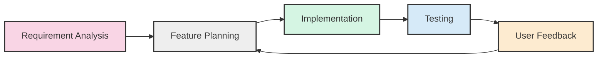

### 1.2 Development Phases
Our development journey consists of key phases:

1. **Planning & Setup**
   - Repository initialization and structure setup
   - Core dependencies identification
   - Basic UI implementation with Streamlit
   - API integration planning

2. **Core Feature Implementation**
   - Document upload and processing setup
   - AI model integration (Gemini)
   - Basic text analysis features
   - Chat interface implementation

3. **Advanced Features**
   - RAG implementation with LangChain
   - Risk analysis functionality
   - Document comparison features
   - Export capabilities

4. **Enhancement & Optimization**
   - Performance improvements
   - Error handling
   - User experience refinement
   - Feature extensions

### 1.3 Collaboration Workflow

Our team follows a structured yet flexible collaboration workflow:

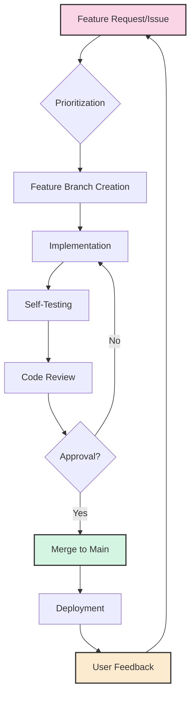

---

### 2. Definition of Done (DoD)

A feature is considered "Done" only when:

✅ Code is written according to standards and best practices  
✅ Unit tests are created and passed  
✅ Integration tests are passed  
✅ Code is reviewed by at least one team member  
✅ Documentation is updated  
✅ Feature is deployed to staging environment  
✅ Feature is tested for functionality and usability  
✅ Product Owner has approved the feature  


## 3. Version Control & GitHub Setup

### 3.1 GitHub Repository Structure
```
advanced-ai-testing/
├── app.py                 # Main application
├── modules/
│   ├── chat_handler.py    # Chat functionality
│   ├── document_analyzer.py # Document processing
│   ├── risk_analyzer.py    # Risk assessment
│   ├── compliance_checker.py # Compliance checking
│   ├── document_comparer.py # Document comparison
│   └── export_handler.py    # Export functionality
├── utils/
│   ├── file_processor.py   # File handling
│   └── state_management.py # Session management
├── .streamlit/
│   └── secrets.toml       # API keys configuration
├── tests/                 # Test cases
│   ├── test_document_analyzer.py
│   ├── test_risk_analyzer.py
│   └── test_chat_handler.py
├── docs/                  # Documentation
│   ├── architecture.md    # System architecture
│   ├── api_reference.md   # API documentation
│   └── user_guide.md      # User documentation
└── requirements.txt       # Dependencies
```

### 3.2 Version Control Strategy
- **Main Branch**: Production-ready code
- **Develop Branch**: Integration branch for features
- **Feature Branches**: Individual feature development
- **Release Branches**: Preparation for releases
- **Hotfix Branches**: Emergency production fixes

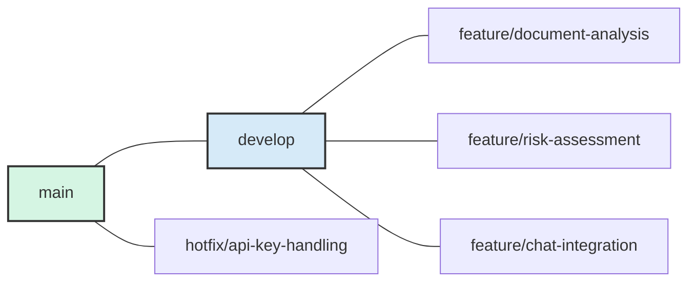

### 3.3 GitHub Automation

We use GitHub features to streamline our development process:

- **Actions**: Automated testing on push/PR
- **Issue Templates**: Standardized bug reports and feature requests
- **Project Board**: Visual tracking of progress
- **Pull Request Reviews**: Collaborative code improvement

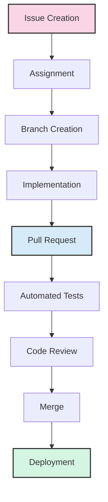

---

## 4. Milestone-Based Development

### 4.1 Milestone Overview

Each milestone represents a significant achievement in our development process, building towards our complete solution:

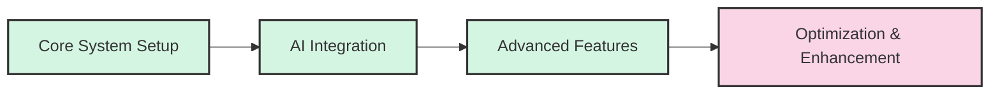

### 4.2 Completed Milestones

#### Milestone 1: Core System Setup ✓
- [x] Project initialization and structure
- [x] Basic UI implementation with Streamlit
- [x] Document upload functionality
- [x] Text extraction implementation
- [x] Basic chat interface

#### Milestone 2: AI Integration ✓
- [x] Gemini API integration
- [x] Document summarization
- [x] RAG implementation with LangChain
- [x] Context-aware responses
- [x] Vector storage setup with FAISS

#### Milestone 3: Advanced Features ✓
- [x] Risk analysis implementation
- [x] Document comparison functionality
- [x] GDPR compliance integration
- [x] Export functionality (PDF, DOCX, TXT)
- [x] Email sharing capabilities

### 4.3 In-Progress Milestone

#### Milestone 4: Optimization & Enhancement (In Progress)
- [ ] Performance optimization
- [ ] Enhanced error handling
- [ ] User experience improvements
- [ ] Additional file format support
- [ ] Extended compliance features


## 5. Project Setup & Execution

### 5.1 Development Environment Setup
1. Clone the repository:
   ```bash
   git clone https://github.com/yourusername/Advanced-AI-testing.git
   cd Advanced-AI-testing
   ```

2. Create and activate virtual environment:
   ```bash
   python -m venv venv
   # For Windows:
   .\venv\Scripts\activate
   # For Linux/Mac:
   source venv/bin/activate
   ```

3. Install dependencies:
   ```bash
   pip install -r requirements.txt
   ```

4. Configure API keys:
   ```bash
   # Create .streamlit/secrets.toml
   GEMINI_API_KEY = "your-api-key-here"
   ```

5. Run the application:
   ```bash
   streamlit run app.py
   ```

### 5.2 Key Dependencies
- streamlit>=1.31.0
- google-generativeai>=0.3.1
- langchain>=0.1.0
- PyPDF2>=3.0.0
- python-docx>=1.0.1
- python-dotenv>=1.0.0

### 5.3 Interactive Development

For an interactive development experience, we recommend:

1. **Hot Reloading**: Streamlit automatically reloads when code changes
   ```bash
   streamlit run app.py
   ```

2. **Debugging Mode**: Run with Python debugger
   ```bash
   python -m debugpy --listen 5678 -m streamlit run app.py
   ```

3. **Component Testing**: Test individual components
   ```bash
   streamlit run modules/document_analyzer.py
   ```

### 5.4 Technical Debt Management

We follow these practices to manage technical debt:

- **Refactoring Cycles**: Regular code improvement sessions
- **Debt Identification**: Tagging code with TODO comments
- **Documentation**: Maintaining up-to-date documentation
- **Code Reviews**: Ensuring quality before merging
- **Prioritization**: Balancing features vs. debt reduction

---

## 6. Code Overview & Functionality

### 6.1 Core Modules & Responsibilities

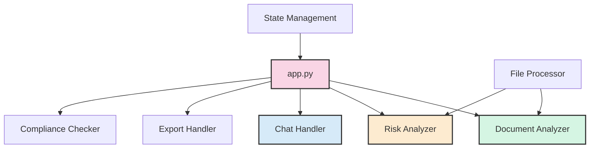

1. **Main Application (`app.py`)**
   - Streamlit UI implementation
   - Navigation and session management
   - Feature integration and routing

2. **Document Analysis (`modules/document_analyzer.py`)**
   - Text extraction from documents
   - Summarization using Gemini API
   - Key information extraction

3. **Risk Analysis (`modules/risk_analyzer.py`)**
   - Risk identification in documents
   - Risk scoring and categorization
   - Risk visualization

4. **Chat Handler (`modules/chat_handler.py`)**
   - Document-based query processing
   - Context-aware responses
   - Conversation management

5. **Export Handler (`modules/export_handler.py`)**
   - Multi-format export support
   - Report generation
   - Email integration

### 6.2 AI Processing Workflow
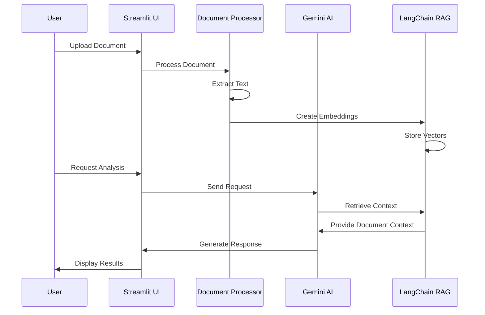

**Key AI Components:**
- Google Gemini API for document analysis
- LangChain RAG for context-aware processing
- FAISS for vector storage and retrieval

### 6.3 User Interface Flow

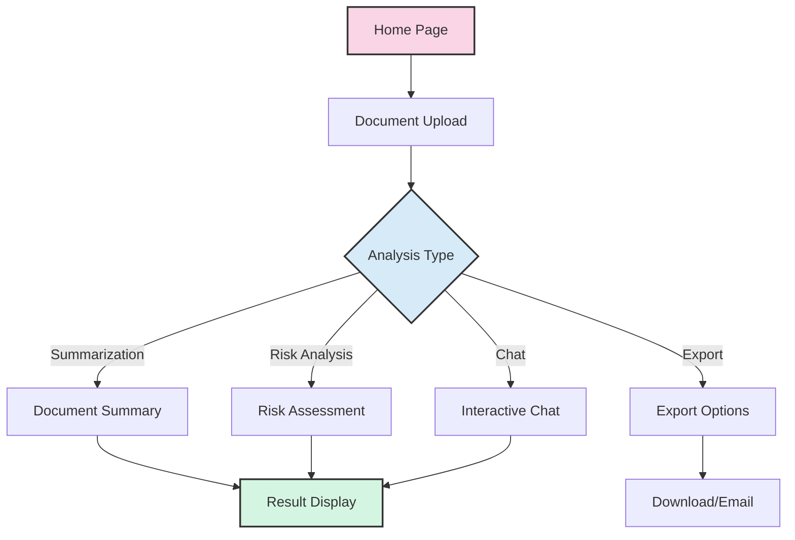

### 6.4 Design Patterns & Architecture

The system follows these design principles:

- **Modular Architecture**: Separation of concerns with distinct modules
- **Singleton Pattern**: For state management and API clients
- **Factory Pattern**: For document processor selection
- **Strategy Pattern**: For different analysis approaches
- **Observer Pattern**: For UI updates based on state changes

---

## 7. Testing & Quality Assurance

### 7.1 Testing Methodology

Our testing approach includes:

1. **Manual Testing**
   - User interface functionality
   - Document processing accuracy
   - AI response quality
   - Export feature verification

2. **Component Testing**
   - Individual module functionality
   - API integration testing
   - Error handling verification
   - Edge case coverage

3. **End-to-End Testing**
   - Complete workflow validation
   - Cross-feature integration
   - Performance benchmarking
   - User journey testing

### 7.2 Quality Metrics

We monitor these key quality indicators:

- **AI Response Accuracy**: Ensuring relevant and accurate AI responses
- **Processing Time**: Measuring document analysis performance
- **Error Rate**: Tracking system failures and exceptions
- **User Satisfaction**: Gathering feedback on usability

### 7.3 Quality Improvement Process

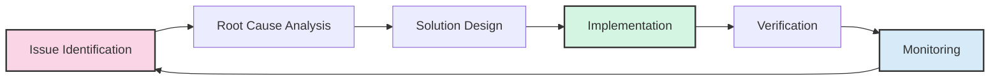

### 7.4 Testing Tools & Frameworks

Our testing utilizes these tools:

- **Pytest**: For unit and integration testing
- **Selenium**: For UI testing
- **Locust**: For performance testing
- **GitHub Actions**: For continuous integration testing
- **Manual Test Scripts**: For usability and functionality verification

---

## 8. Feedback & Iteration Cycles

### 8.1 User Feedback Collection

We gather feedback through multiple channels:

- **In-app Feedback**: Direct user input within the application
- **Testing Sessions**: Observed user interactions
- **Issue Reports**: GitHub issue tracking
- **Feature Requests**: User-submitted enhancement ideas

### 8.2 Feedback Integration Process

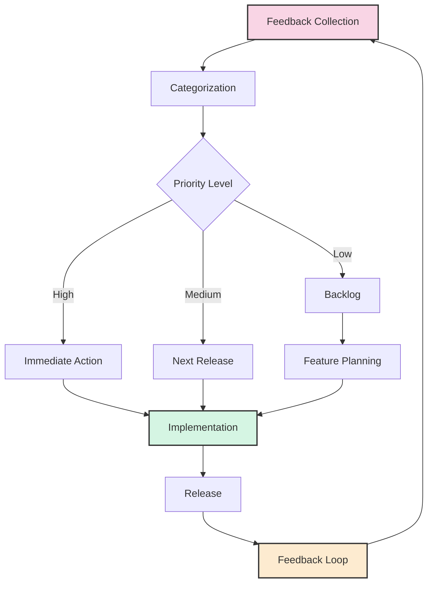

### 8.3 Iterative Development Metrics

We track these key iteration metrics:

- **Cycle Time**: Duration from feature request to implementation
- **Bug Resolution Time**: Time to resolve reported issues
- **Feature Adoption**: User engagement with new features
- **Improvement Rate**: Enhancement velocity over time

### 8.4 Stakeholder Engagement

Regular touchpoints with stakeholders ensure alignment:

- **Demo Sessions**: Showcasing new features and improvements
- **Feedback Workshops**: Gathering detailed input on specific features
- **Progress Reports**: Regular updates on development status
- **Requirement Validation**: Ensuring implementations meet needs

---

## 9. Risk Management

### 9.1 Risk Categories

We monitor and mitigate risks across these categories:

| Category | Description | Mitigation Strategy |
|----------|-------------|---------------------|
| **Technical** | Risks related to technology, architecture, and implementation | Regular code reviews, proper testing, technology validation |
| **Resource** | Risks related to people, time, and budget constraints | Proper planning, prioritization, scope management |
| **Quality** | Risks affecting system reliability, performance, and user experience | Testing, monitoring, quality metrics tracking |
| **External** | Risks from third-party dependencies, regulations, and market changes | Vendor assessment, compliance checks, market monitoring |

### 9.2 Top Project Risks

The following risks have been identified and are actively managed:

1. **AI Model Limitations**
   - **Impact**: Affects quality of document analysis
   - **Mitigation**: Regular model evaluation, fallback mechanisms, user-driven corrections

2. **API Dependency**
   - **Impact**: External API changes or outages affect functionality
   - **Mitigation**: Error handling, API monitoring, graceful degradation

3. **Performance with Large Documents**
   - **Impact**: User experience degradation with complex documents
   - **Mitigation**: Chunking strategies, progress indicators, optimization techniques

4. **Data Privacy & Security**
   - **Impact**: Compliance issues, user trust concerns
   - **Mitigation**: GDPR compliance, data minimization, secure processing

### 9.3 Risk Monitoring

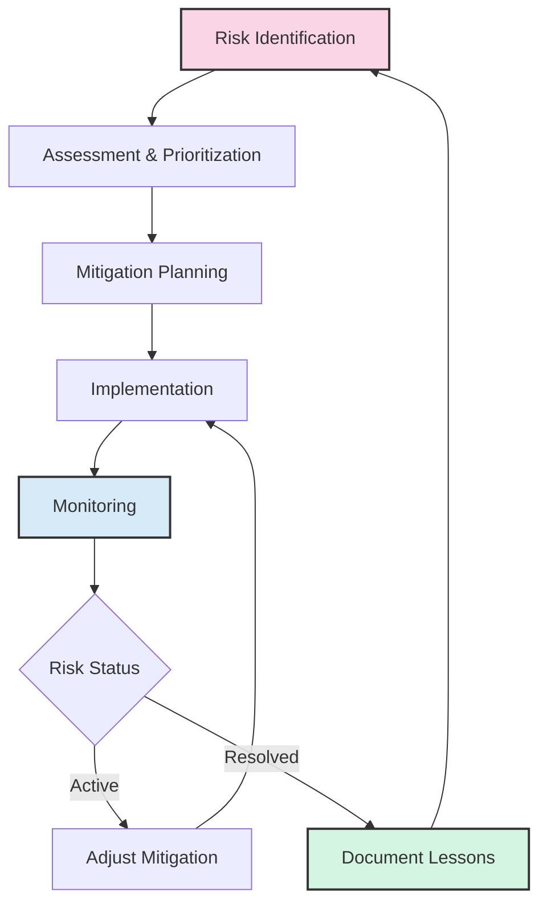

---

## 10. Release Strategy

### 10.1 Release Cadence

We follow a structured release process:

- **Major Releases**: Feature-complete milestones 
- **Minor Releases**: Feature additions and enhancements 
- **Patch Releases**: Bug fixes and minor improvements (as needed)

### 10.2 Release Process

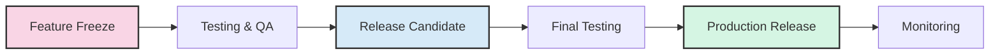

### 10.3 Feature Flagging

We utilize feature flags to manage releases:

- **Gradual Rollout**: Introducing features to limited users first
- **A/B Testing**: Comparing different implementations
- **Controlled Activation**: Enabling features when fully tested
- **Emergency Deactivation**: Quickly disabling problematic features

### 10.4 Documentation & Release Notes

Each release includes:

- **Change Log**: Detailed list of changes and improvements
- **Known Issues**: Documented limitations and workarounds
- **User Guidance**: Updated instructions for new features
- **Upgrade Notes**: Instructions for existing installations

---

## 11. Evaluation & Next Steps

### 11.1 Current Achievements
- **Document Processing**: Successfully handling multiple formats
- **AI Integration**: Effective implementation of Gemini and RAG
- **User Interface**: Functional and intuitive Streamlit interface
- **Export Features**: Multiple format support and sharing options

### 11.2 Performance Metrics

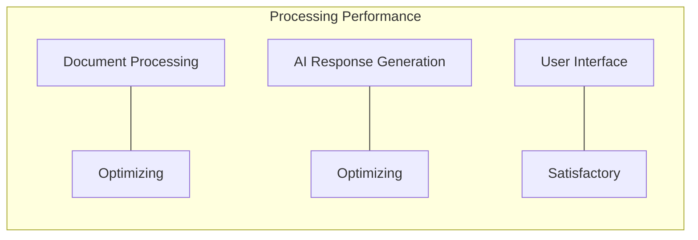

### 11.3 Areas for Improvement
1. **Performance Optimization**
   - Enhance processing speed
   - Optimize memory usage
   - Improve response times

2. **Feature Enhancement**
   - Additional file format support
   - Enhanced error handling
   - Extended compliance features

3. **User Experience**
   - Interface refinements
   - Better error messaging
   - Improved navigation


### 11.5 Long-term Vision
- **Advanced AI Integration**: Incorporating specialized legal AI models
- **Extended Document Analysis**: Deeper legal context understanding
- **Collaboration Platform**: Multi-user document collaboration
- **Integration Ecosystem**: Connecting with legal research tools

---

<div align="center">

## Conclusion

This Agile Development Plan represents our commitment to building a robust, user-focused legal document analysis system through iterative development and continuous improvement.

*Version 1.0 - Last Updated: March 2025*

</div>
